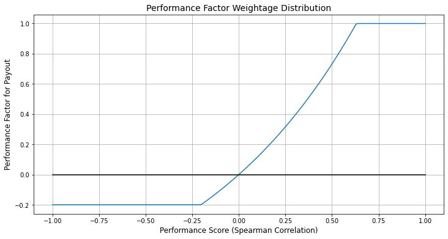
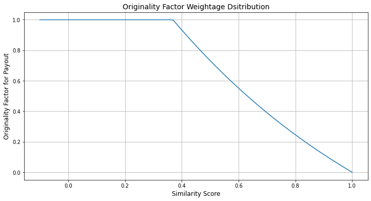
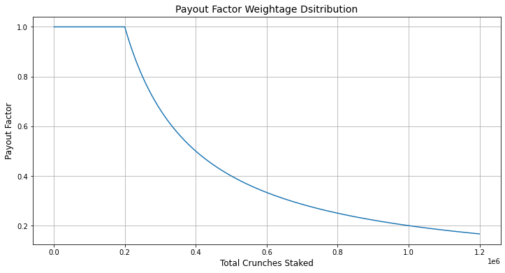
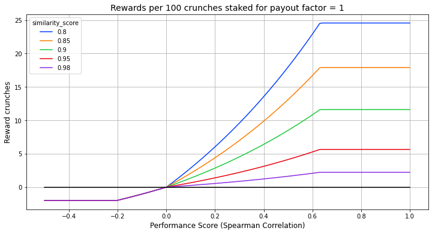

# Staking Proposal

Here is a staking proposal for CrunchDAO to enable people to stake on their models and get returns based on the performance and originality of their model.

Three factors are included for the final payment in this proposal.

1. Performance Factor
2. Originality Factor
3. Payout Factor

Let us dive deep into each of these factors.


```python
import math
import numpy as np
import pandas as pd

import matplotlib.pyplot as plt
import seaborn as sns
%matplotlib inline
```

### Performance Factor

This factor is based on the actual model performance on the live data. For now, we can continue to use the `Spearman Correlation Coefficient` to compute the performance factor. The performance factor is limited between -0.2 to 1. 

We have a performance constant which can be tweaked to modify the performance factor distribution. Currently, it is set to 3 which can be modified later based on actual spearman scores. Here is a function to portray the performance factor computation based on input performance score (spearman score).


```python
def get_performance_score_factor(performance_score):
    """Function to get the weightage score for performance"""
    # Constant for performance scaling
    performance_constant = 3
    score_w = pow(performance_constant, performance_score) - 1
    # Floor the weightage at -0.2 to minimize the loss.
    score_w = max(score_w, -0.2)
    # Ceil the weightage at 1
    score_w = min(score_w, 1)
    return score_w
```

We can see the distribution of the performance factor for different spearman scores.


```python
df = pd.DataFrame([(i,get_performance_score_factor(i)) for i in np.arange(-1,1.001,.01)])
df.columns = ["performance_score", "score_weightage"]

plt.figure(figsize=(12,6))
sns.lineplot(data=df, x="performance_score", y="score_weightage")
plt.title("Performance Factor Weightage Distribution", fontsize=14)
plt.xlabel('Performance Score (Spearman Correlation)', fontsize=12)
plt.ylabel('Performance Factor for Payout', fontsize=12)
plt.plot(df["performance_score"].values, [0]*df.shape[0], color='black')
plt.grid()
plt.show()
```


    

    


**Inference:**

* If the performance score is high, then the performance factor is high and vice versa.
* As we could see, the performance factor is limited between -0.2 to 1
* The performance factor reaches 1 when the spearman score hits ~0.6
* The performance factor reaches -0.2 when the spearman falls below ~-0.2
* In the initial months, we can limit the performance factor between 0 to 1 to avoid coin burns as needed.

### Originality Factor:

Next one is originality factor which is based on the originality of the model. 

A similarity score is needed to compute the originality factor. One way to compute the similarity score is to get the spearman correlation of the given submission with all the *staked* submissions and then taking the mean value. This will give an idea of how original the given submission is compared to other staked ones. This will also be a continuous value rather than a discrete value. We can use clustering here to get the similarity score instead of spearman correlation with all submissions.

Once we have the similarity score, we can use the following function to compute the originality factor. Here again, we have a originality constant (set to 3), which can be tweaked to modify the originality factor distribution as needed at a later stage.

Also, if the performance score is less than 0, then the originality factor is a constant value of 0.1 to cap the losses again.


```python
def get_originality_factor(similarity_score, performance_score_w):
    """Function to get the weightage for originality"""
    # Constant for exponential scling
    originality_constant = 3
    originality_w = pow(originality_constant, (1-similarity_score))
    # Ceil the weightage at 1
    originality_w = min(originality_w, 2) - 1
    # If the spearman score is less than 0, use a constant weight
    if performance_score_w < 0:
        originality_w = 0.1
    return originality_w
```

We can see the originality factor distribution for different similarity scores.


```python
df = pd.DataFrame([(i,get_originality_factor(i,0.1)) for i in np.arange(-0.1,1.001,.01)])
df.columns = ["similarity_score", "originality_score_weightage"]
# df2 = pd.DataFrame([(i,get_originality_weightage(i,-0.1)) for i in np.arange(-1,1.001,.01)])
# df2.columns = ["originality_score", "originality_score_weightage"]

plt.figure(figsize=(12,6))
sns.lineplot(data=df, x="similarity_score", y="originality_score_weightage")
# sns.lineplot(data=df2, x="originality_score", y="originality_score_weightage", color='r')
plt.title("Originality Factor Weightage Dsitribution", fontsize=14)
plt.xlabel('Similarity Score', fontsize=12)
plt.ylabel('Originality Factor for Payout', fontsize=12)
plt.grid()
plt.show()
```


    

    


**Inference:**
* If the similarity score is high, then the originality factor is low and vice versa.
* if the similarity score is less than ~0.37, then the originality factor is set to 1 which is maximum.

### Payout Factor

The final one is payout factor. This will not be of value now but will add value later when we have a lot of crunches staked to limit the payout in each cycle.

The payout factor will be 1 till we the `total staked crunches` reach 200K and then decrease from there on. Here is a function for the same.


```python
def get_payout_factor(total_staked_crunches):
    """Function to get payout factor"""
    payout_factor_constant = 200_000
    payout_factor = min(1, payout_factor_constant/total_staked_crunches)
    return payout_factor
```


```python
df = pd.DataFrame([(i,get_payout_factor(i)) for i in np.arange(1000,1_200_000,1000)])
df.columns = ["total_crunches_staked", "payout_factor"]

plt.figure(figsize=(12,6))
sns.lineplot(data=df, x="total_crunches_staked", y="payout_factor")
plt.title("Payout Factor Weightage Dsitribution", fontsize=14)
plt.xlabel('Total Crunches Staked', fontsize=12)
plt.ylabel('Payout Factor', fontsize=12)
# plt.plot(df["spearman_correlation_score"].values, [0]*df.shape[0], color='r')
plt.grid()
plt.show()
```


    

    


### Example Payout Calculation:

Now let us take an example and compute the payout for that scenario.

Let us assume that,
* Spearman correlation score = 0.25 &
* Similarity score with other staked submissions = 0.8
* Total crunches staked = 200K
* Crunches staked by the individual = 100

Let us compute the reward that the individual will get in that cycle.


```python
performance_score = 0.25
similarity_score = 0.8
total_staked_crunches = 200_000
individual_staked_crunches = 100

score_w = get_performance_score_factor(performance_score)
originality_w = get_originality_factor(similarity_score, score_w)
payout_w = get_payout_factor(total_staked_crunches)
reward = (score_w * originality_w * payout_w) * individual_staked_crunches
reward
```

So in this example, the person will get a reward of 7.76 crunches by staking 100 crunches. 

Now let us extend this and plot the rewards curve for different performance and similarity scores.


```python
olist = []
for similarity_score in [0.8, 0.85, 0.9, 0.95, 0.98]:
    for performance_score in np.arange(-0.5, 1.001, 0.01):
        score_w = get_performance_score_factor(performance_score)
        originality_w = get_originality_factor(similarity_score, score_w)
        payout_w = get_payout_factor(total_staked_crunches)
        reward = (score_w * originality_w * payout_w) * individual_staked_crunches
        olist.append([performance_score, similarity_score, reward])
df = pd.DataFrame(olist)
df.columns = ["performance_score", "similarity_score", "reward"]

plt.figure(figsize=(12,6))
sns.lineplot(data=df, x="performance_score", y="reward", hue="similarity_score", palette="bright")
plt.title("Rewards per 100 crunches staked for payout factor = 1", fontsize=14)
plt.xlabel('Performance Score (Spearman Correlation)', fontsize=12)
plt.ylabel('Reward crunches', fontsize=12)
plt.plot(df["performance_score"].values, [0]*df.shape[0], color='black')
plt.grid()
plt.show()
```



The above graph is an indication of how the rewards will be distributed in each cycle for different scores.

# Proposal Considerations:

### Originality:
Originality is directly included in the reward computation as explained above.

### Sybil Attacks:
Since the payout is only for the staked users, using multiple accounts will be discouraged as there is no incentive in submitting from multiple accounts as the originality factor will reduce if ones does that. Even without staking, the originality factor in reward computation will be a deterrant for sybil attacks.

Infact, we can allow the users to submit multiple models at a later stage which are varied in nature. This will help in increasing the diversity of the model.

### Cycle Budget:
The payouts can be done monthly / weekly and so let us call this as a cycle. From the past competitions, the top best spearman correlation score is close to 0.3. Now that we have moved to v4, the scores will decrease further. 

So, assuming an average spearman score (performance score) of 0.2 for all staked submissions (a conservative number) and an average similarity score of 0.9, the amount of budget needed for 1 cycle would be `5.7K Crunches` as seen below. 


```python
performance_score = 0.2
similarity_score = 0.9
total_staked_crunches = 200_000
individual_staked_crunches = 200_000

score_w = get_performance_score_factor(performance_score)
originality_w = get_originality_factor(similarity_score, score_w)
payout_w = get_payout_factor(total_staked_crunches)
reward = (score_w * originality_w * payout_w) * individual_staked_crunches
reward
```

Even if we give weekly rewards, this will be ~300K Crunches per year. Assuming overall 3M crunches will be assigned for Tournament rewards, the staking rewards will last for 10 years at the current rate.   

### Attract & Keep the best

The originality factor will attract the new feature generation / modeling ideas and deter the same type of models being built. This will attract and reward the best performers. 

### Alpha provider tournament

Same approach can be used for alphha provider tournament as well. The correlation score of the alpha features with the target will be the performance score. The alpha feature will be correalted with other alpha features to get the originality score. Finally rewards can be calculated with minor tweaks as needed. 

# Future Considerations:

* If we want to move to True contribution / Meta model contribution, we can extend the above method and split the payout factor weightage into 2 - one for performance score and another one for contribution score. This will help align the fund performance with the individual performance.

* Rewards ratio can be adjusted by tweaking the constants (performance constant, originality constant and payment factor constant), which can be governed by the DAO.

Thank you!

-- SRK
