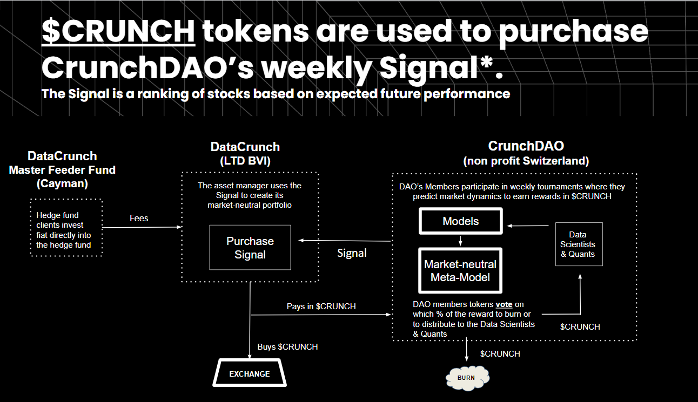

\newpage

# List of contributors

| Full Name | Github @ | Discord @ | Date |
|----------|:---------------:|:-----------------:|------------|
| Matteo Manzi | matteoettam09 | matteoettam09#9362 | 2022/10/28 |
| Enzo Caceres | caceresenzo| Enzo Caceres#4224 | 2022/11/07 |
|||||
|||||

\newpage

# Crowdsourced Investment Research

## Introduction

[@Prado_2018] and [@Craib_2017] will be discussed here.

Figure \ref{fig:vc}:

CrunchDAO aims at providing a \textit{market-neutral} signal: a signal able to generate returns regardless of market conditions. 

\begin{equation}
r_i = \sum_k X_{ik} f_k + u_i
\end{equation}

By balancing our model with long and short positions, we minimise our exposure to any inherent market risks.

## The Tournament

[@Prado_2019] will be discussed in this section;

### Data

- Quantization & Obfuscation. Quantile-based/fixed scale quantization.

Proprietary Data and Community Data.

- [Weavechain](https://www.weavechain.com/): [arweave](https://www.arweave.org/) and [filecoin](https://filecoin.io/) make use of IPFS, they do not. Data do not go on chain. [BeekeperAI](https://www.beekeeperai.com/)

- Homomorphic Encryption links [here](https://github.com/microsoft/EVA), [here](https://github.com/microsoft/SEAL), [here](https://www.zama.ai/) CKKS [here](https://blog.openmined.org/ckks-explained-part-1-simple-encoding-and-decoding/).

- [Federated learning](https://en.wikipedia.org/wiki/Federated_learning) + [Ocean Protocol](https://oceanprotocol.com/) for new datasets.

- Confidential Computing: [paper](https://arxiv.org/abs/2110.01390) and [repo](https://github.com/data61/MP-SPDZ) discussing SPDZ.

- [PySyft](https://github.com/OpenMined/PySyft): Syft allows a Data Scientist to ask questions about a dataset and, within privacy limits set by the data owner, get answers to those questions, all without obtaining a copy of the data itself.

- [Zero-knowledge proof](https://en.wikipedia.org/wiki/Zero-knowledge_proof)

CrunchDAO makes use of different datasets.

- C-MECHANICS: This strategy is a trend-following strategy based on the trend of idiosyncratic (an individualizing characteristic) return and volatility.
- E-KINETIC: This momentum outlook aims to systematically isolate and harvest excess returns arising from behavioral market anomalies by investing in diversification, not performance.
- B-VOLATILITY: This strategy identifies distortions in volume, price, and volatility between short-dated options and stock prices.
- 3B1-SIGNAL: Institutional investors are leveraging equity factor risk models (Sector / Country Stock etc.) to predict return and hedge their bets.  We investigate the extent to which nonlinearities not captured by standard linear models within equity factor risk models are present. Some generated factor returns and information ratios higher than corresponding linear factors
- DOLLY: Portfolio managers invest a tremendous amount of time and resources in identifying equity that will outperform the market in the long term - alpha- ; In Dolly, the community leverages machine learning to select top long-term asset managers and piggyback their trades. Securities and Exchange Commission (SEC) 13f filing data offer valuable insight into top asset managers’ holdings at each quarterly filing point.
- GORDON-GEEKO: This strategy uses trade information from top management and senior executives (i.e. insiders) as it has been demonstrated in past academic research that insiders have insight - or alpha - over other investors.

### Staking

### The Scoring System

- [Spearman's rank correlation coefficient](https://en.wikipedia.org/wiki/Spearman%27s_rank_correlation_coefficient)

## Clustering and Dimensionality Reduction

Symbil attacks: [@Li_2017].

[@Avellaneda_2019], [@Akansu_2021] will be discussed here.

## Ensemble learning

Ensamble Averging will be presented here.

## Porfolio Optimization

[@Chriss_2005], [@Crama_2003]

The constraints for CrunchDAO's portfolio are neutrality with respect to dollar, Risk Indices, Styles factors and Industry factors.

Markovitz porfolio theory and constraints are discussed here.

# References
